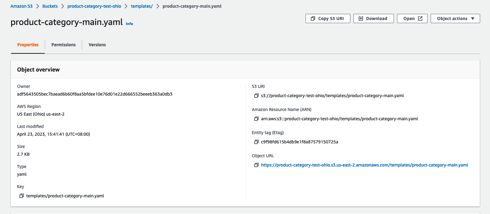
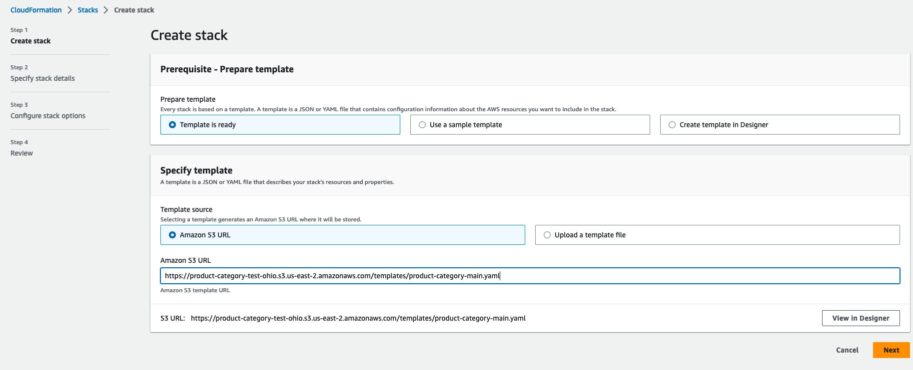
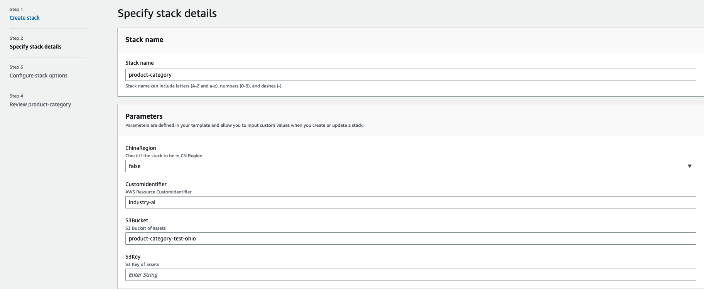
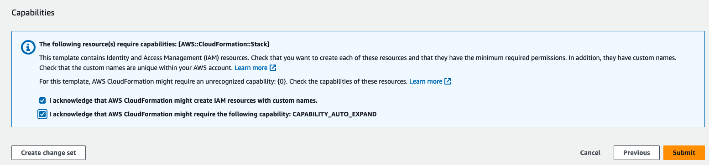
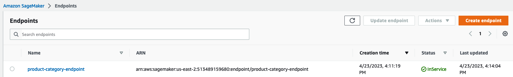
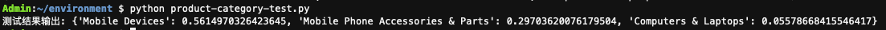

# product_category


## Getting started

To make it easy for you to get started with GitLab, here's a list of recommended next steps.

Already a pro? Just edit this README.md and make it your own. Want to make it easy? [Use the template at the bottom](#editing-this-readme)!

## Add your files

- [ ] [Create](https://docs.gitlab.com/ee/user/project/repository/web_editor.html#create-a-file) or [upload](https://docs.gitlab.com/ee/user/project/repository/web_editor.html#upload-a-file) files
- [ ] [Add files using the command line](https://docs.gitlab.com/ee/gitlab-basics/add-file.html#add-a-file-using-the-command-line) or push an existing Git repository with the following command:

```
cd existing_repo
git remote add origin https://gitlab.aws.dev/aws-gcr-industrysolution/product_category.git
git branch -M main
git push -uf origin main
```

## Depolyment guild

0、安装git-lfs, git lfs clone https://github.com/paulhebo/category_predict.git 下载项目代码

1、新建S3 BUCKET

2、下载项目代码后，进deployment文件夹，运行基础代码部署脚本

`./build_and_deploy.sh s3://BUCKET_NAME REGION`

3、基础代码部署脚本运行完成后，会将相应文件上传到S3存储桶，打开BUCKET_NAME/templates/product-category-main.yaml，复制配置文件的Object URL



4、打开CloudFormation,开始根据模版部署资源

（1）在CloudFormation上点击“Create Stack”,在 Amazon S3 URL下输入配置文件的Object URL，点击下一步



（2）输入Stack name和S3Bucket，其余参数默认，点击下一步



（3）最后确认后点击提交，并等待CloudFormation部署完成



5、部署SageMaker Endpoint, 进入项目代码的endpoint目录，运行部署代码

`python deploy`

 等待Endpoint部署完成，可以进入SageMaker/inference/endpoint中查看部署是否完成

 

 6、Endpoint部署完成后，可以通过以下代码测试功能是否正常

```python
import json
import boto3
lambda_client = boto3.client('lambda')
query = 'iphone 14 pro'
body={
"httpMethod":"POST",
"body":'{"inputs":["' + query + '"]}',
"headers":{"content-type":"application/json"},
"queryStringParameters":{"endpoint_name":"product-category-endpoint"}
}
response = lambda_client.invoke(
FunctionName = 'industry_ai_inference',
InvocationType = 'RequestResponse',
Payload = json.dumps(body)
)
payload = response["Payload"].read().decode("utf-8")
payload = json.loads(payload)
result = json.loads(payload['body'])
print('测试结果输出:',result['result'])
```
输出结果：


